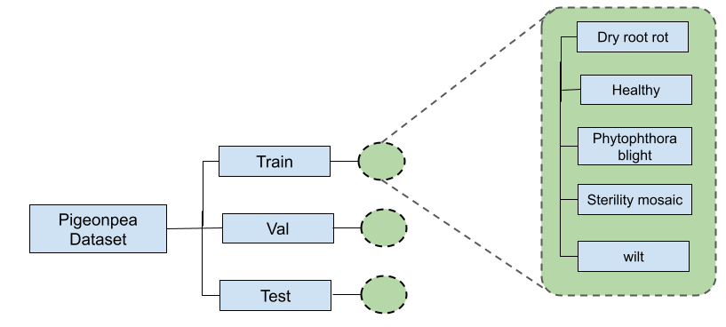

# Dataset is publicly available for research purpose
ping dataset request on Email: 2018pec901@sggs.ac.in

# Dataset folder tree
Prepare dataset folder structure like this 

# Example shown below for Pigeon-pea dataset with Five classes.

# Sample images from Pigeon-pea dataset.

Dataset-- Train      -- Class 0  
&nbsp;&nbsp;&nbsp;&nbsp;&nbsp;&nbsp;&nbsp;&nbsp;&nbsp;                  -- Class 1  
&nbsp;&nbsp;&nbsp;&nbsp;&nbsp;&nbsp;&nbsp;&nbsp;&nbsp;                     -- Class 3  
&nbsp;&nbsp;&nbsp;&nbsp;&nbsp;       -- Validation -- Class 0  
&nbsp;&nbsp;&nbsp;&nbsp;&nbsp;&nbsp;&nbsp;&nbsp;&nbsp;                     -- Class 1  
&nbsp;&nbsp;&nbsp;&nbsp;&nbsp;&nbsp;&nbsp;&nbsp;&nbsp;                     -- Class 3  
&nbsp;&nbsp;&nbsp;&nbsp;&nbsp;       -- Test       -- Class 0  
&nbsp;&nbsp;&nbsp;&nbsp;&nbsp;&nbsp;&nbsp;&nbsp;&nbsp;                     -- Class 1  
&nbsp;&nbsp;&nbsp;&nbsp;&nbsp;&nbsp;&nbsp;&nbsp;&nbsp;                     -- Class 3  

